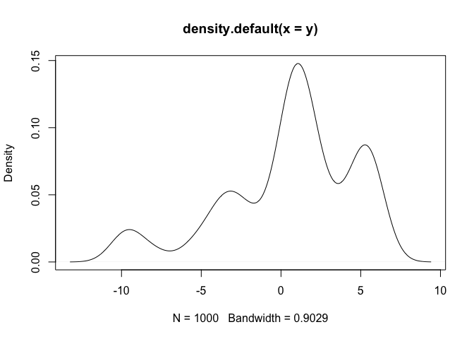
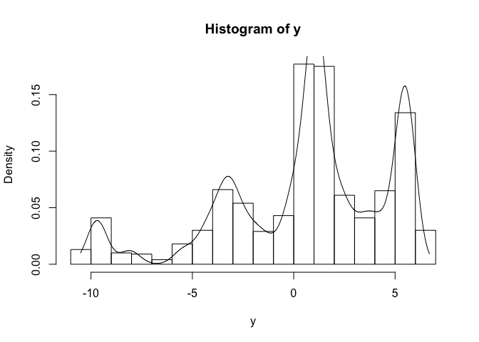
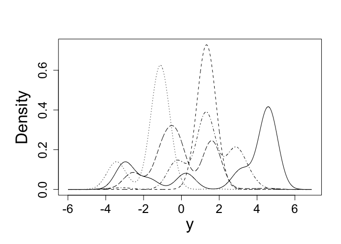

# Dirichlet Process Mixtures
Luis Campos  
March 26, 2015  

We wish to explain and implement estimation procedures for Dirichlet Process Mixtures.

# Dirichlet Process
Let's begin by explaining a bit about Dirichlet process and the dirichlet process mixture, Take $P(\theta) \sim DP(\alpha P_0)$ be a prior distribution for the centers of Normal distributions that define its mixture. 


```r
# - - - - - - - - - - - - - - - - - - - - - - - - - - - - - - - - - - - #
# This function generates a set of mixture weights using the 
#	stick-breaking scheme 
# - - - - - - - - - - - - - - - - - - - - - - - - - - - - - - - - - - - #
stick_break = function(n, alpha){
	n.sim = n
	V = rbeta(n.sim, 1, alpha)
	pi = V*c(1, cumprod(1-V)[-n.sim])
	pi
}
```

# Example draw from a Dirichlet Process


```r
n = 500
alpha = 30
pi = stick_break(n, alpha)
theta = rnorm(n)
```
 


```r
	# - - - - - - - - - - - - - - - - - - - - - - - - - - - - - - #
	# A more complex stick-breaking function
	# stick_break = function
	#	in: alpha - Stick-break lengths
	#		max.n - maximal number of groups
	#		beta - cuts off the number of clusters to first 99%
	# - - - - - - - - - - - - - - - - - - - - - - - - - - - - - - #

	stick_break = function(alpha, max.n = 500, beta = 0.99){
		n.sim = max.n
		# get stick-break proportions
		V = rbeta(n.sim, 1, alpha)
		# calculate stick breaks
		pi = V*c(1, cumprod(1-V)[-n.sim])
		# get breaks making up (beta)% of stick
		pi[cumsum(pi) < 0.99]
	}

	alpha = 40
	base = rnorm
	params = list(mean = 0, sd = 1)
	params$n = n 		#$
	# - - - - - - - - - - - - - - - - - - - - - - - - - - - - - - #
	# Simulate a draw from a DP(alpha base)
	# stick_break = function
	#	in: n - sample size to be drawn from a DP prior
	#		alpha - concentration parameter
	#		base - a base distribution to be drawn from (e.g. rnorm, rt, rchisq, ..)
	#		params - parameters to be handed to function "base"
	#	alpha = 40
	#	base = rnorm
	#	params = list(mean = 0, sd = 1) # depending on the base function
	#	call: rDP(100, alpha = 40, base = rnorm, params = list(mean = 0, sd = 1))
	# - - - - - - - - - - - - - - - - - - - - - - - - - - - - - - #

	rDP = function(n, alpha = NULL, base = NULL, params = NULL){
		# calculate stick break up to 99% of the stick
		pi = stick_break(alpha)
		K = length(pi)
		# generate theta*
		params$n = K		#$
		theta_star = do.call(base, args = params)
		# sample from the Dirichlet process
		theta = sample(theta_star, n, prob = pi, replace = TRUE)
		out = list(theta = theta, pi = pi, theta_star = theta_star, n = n)
		class(out) <- "DP"
		return(out)
	}


	rDP_draw = function(alpha = NULL, base = NULL, params = NULL){
		# calculate stick break up to 99% of the stick
		pi = stick_break(alpha)
		K = length(pi)
		# generate theta*
		params$n = K		#$
		theta_star = do.call(base, args = params)
		out = list(pi = pi, theta_star = theta_star, alpha = alpha, base = base, params = params)
		class(out) <- "DP"
		return(out)
	}

	rDP.ex = rDP_draw(alpha = 40, base = rnorm, params = list(mean = 0, sd = 1))

	plot.DP = function(X){
		pi = X$pi
		theta = X$theta_star
		plot(theta, pi, pch = NA, xlab = expression(theta), ylab = expression(pi), main = expression(Figure~1:~Example~distribution~P%~%DP(alpha~P[0])), xlim = 1.1*range(theta))
		# draw base distribution Po
		x = seq(-3, 3, 0.01)
		lines(x, dnorm(x)/alpha, col = 'grey')
		# draw P
		segments(theta, 0, theta, pi, lwd = 1)
		text(1.1*min(theta), 0, '...', cex = 2)
		text(1.1*max(theta), 0, '...', cex = 2)
		legend('topright', c(expression(P[0]%~%N(0,1)), expression(P%~%DP(alpha~P[0]))), lty = 1, col = c('grey', 'black'))

	}

	# - - - - - - - - - - - - - - - - - - - - - - - - - - - - - - - - - - -  #
	#	dnormMix: provides density heights for a mixture of Normals
	#	in: means - a vector of means (length K)
	#		sds - a vector of sds (length K)
	#		pi - mixture weights (length K)
	# - - - - - - - - - - - - - - - - - - - - - - - - - - - - - - - - - - -  #
	dnormMix = function(means, sds, pi){
		p.raw = mapply(function(m, s, p){p*dnorm(t, mean = m, sd = s)}, means, sds, pi, SIMPLIFY = FALSE)
		p.out = colSums(do.call('rbind', p.raw))
	}


	# - - - - - - - - - - - - - - - - - - - - - - - - - - - - - - #
	# We'll use the above functions to create a mixture 
	# - - - - - - - - - - - - - - - - - - - - - - - - - - - - - - #

	n = 1000
	# 
	out = rDP(n, alpha = 20, base = rnorm, params = list(mean = 0, sd = 3))

	# create a mixture with means theta and noise sd = 0.5
	y = rnorm(n, sd = 0.5) + out$theta
	plot(density(y))
```

 

```r
	hist(y, breaks = 20, prob = TRUE)

	# draw mixture of Normals
	r.y = range(y)

	t = seq(r.y[1], r.y[2], 0.01)
	height = dnormMix(out$theta_star, rep(0.5, length(out$theta_star)), out$pi)

	lines(t, height)
```

 

```r
	# - - - - - - - - - - - - - - - - - - - - - - - - - - - - - - - - - - -  #
	#	
	# - - - - - - - - - - - - - - - - - - - - - - - - - - - - - - - - - - -  #
	# generate some draws from rDP and create mixtures
	ex.reps = replicate(5, rDP(n, alpha = 1, base = rnorm, params = list(mean = 0, sd = 3)), simplify = FALSE)

	r.y = range(do.call('c', lapply(ex.reps, function(x) x$theta_star)))*1.5

	t = seq(r.y[1], r.y[2], 0.01)
	height = lapply(ex.reps, function(out){
		dnormMix(out$theta_star, rep(0.5, length(out$theta_star)), out$pi)
		})

	par(mar = c(5, 6, 4, 2))
	plot(NA, xlim = r.y, ylim = range(unlist(height)), xlab = expression(y), ylab = 'Density', main = "", cex.main = 2.5, cex.lab = 2, cex.axis = 1.5)
	for(i in 1:length(height)){
		 lines(t, height[[i]], lty = i)
	}
```

 
